# Render Test Report

* Generation Time (UTC): 2025-10-04 13:19:19.241555+00:00
* 53 cases, 53 passed (100.000000%)
* Total time spent: 3385 seconds

Note that timing is wall-clock time estimated *per-worker*. Depending on the settings, a worker could be a thread or process, etc. If the tests are run in parallel, timing can be higher than its sequential counterpart.

## System Information

* OS: Windows
* CPU: Intel64 Family 6 Model 79 Stepping 1, GenuineIntel (12 logical, 6 physical)
* RAM: 127.913 GiB installed
* Disk: 931.51 GiB total, 312.45 GiB available, 619.06 GiB used

## Failed Tests (0)

All tests passed.

## Passed Tests (53)

* [(3) Test Checkerboard Emissive Quad (109s)](#test-checkerboard-emissive-quad)
* [(7) Test Environment Map (264s)](#test-environment-map)
* [(3) Test Fullscreen Unit Radiance (16s)](#test-fullscreen-unit-radiance)
* [(2) Test Glossy Plane (124s)](#test-glossy-plane)
* [(7) Test Gray Furnace Box (476s)](#test-gray-furnace-box)
* [(5) Test Lerped Lambertian Diffuse (729s)](#test-lerped-lambertian-diffuse)
* [(8) Test Single Ply Mesh (447s)](#test-single-ply-mesh)
* [(7) Test Threading Cornell Box With Gold Sphere (725s)](#test-threading-cornell-box-with-gold-sphere)
* [(2) Test White 100W Point Light (141s)](#test-white-100w-point-light)
* [(3) Test White 100W Rect Area Light (167s)](#test-white-100w-rect-area-light)
* [(2) Test White 100W Small Rect Area Light (24s)](#test-white-100w-small-rect-area-light)
* [(4) Test White 500W Rect Area Light Side (156s)](#test-white-500w-rect-area-light-side)

## Test Checkerboard Emissive Quad

A emissive quad is placed in front of the camera. The emission is textured with a
checkerboard image. The quad will perfectly fit the rendered image (i.e., the rendered output
should be identical to the checkboard image, with a different resolution).

Contains 3 test case(s) (BNEEPT, BVPT, SPPM).

### (1/3) Case BNEEPT: *\<PASSED\>*

Time spent: 30 seconds.

|  Output  |  Reference  |
| :------: | :---------: |
|        |           |

#### Debug Output

### (2/3) Case BVPT: *\<PASSED\>*

Time spent: 61 seconds.

|  Output  |  Reference  |
| :------: | :---------: |
|        |           |

#### Debug Output

### (3/3) Case SPPM: *\<PASSED\>*

Time spent: 18 seconds.

|  Output  |  Reference  |
| :------: | :---------: |
|        |           |

#### Debug Output

## Test Environment Map

An object is being illuminated by an environment map.

Contains 7 test case(s) (BNEEPT (debug map + sphere + shifted), BNEEPT (debug map + sphere), BNEEPT (white map + sphere), BVPT (debug map + sphere + shifted), BVPT (debug map + sphere), BVPT (white map + sphere), PPPM (white map + plane)).

### (1/7) Case BNEEPT (debug map + sphere + shifted): *\<PASSED\>*

All settings are the same with "BNEEPT (debug map + sphere)" case, except the sphere and camera are shifted 2000 units in +x. The result should be the same as our environment map depends on view direction only.

Time spent: 64 seconds.

|  Output  |  Reference  |
| :------: | :---------: |
|    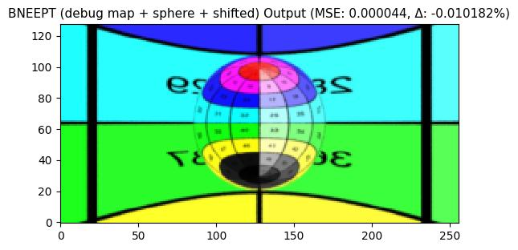    |      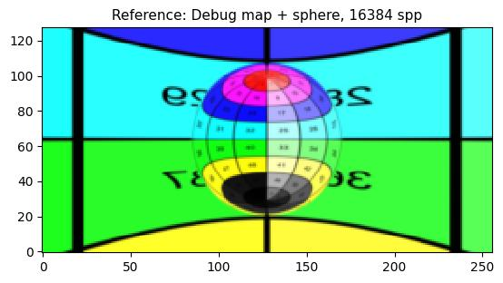     |

#### Debug Output

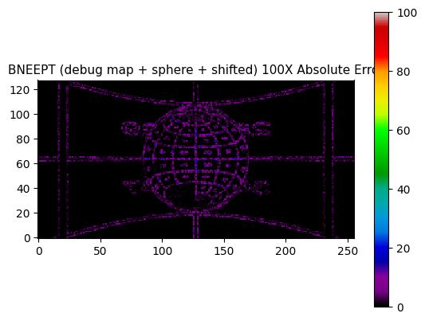

### (2/7) Case BNEEPT (debug map + sphere): *\<PASSED\>*

Time spent: 37 seconds.

|  Output  |  Reference  |
| :------: | :---------: |
|    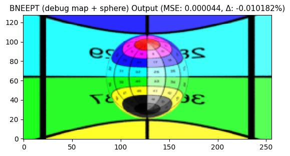    |           |

#### Debug Output

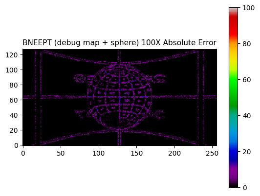

### (3/7) Case BNEEPT (white map + sphere): *\<PASSED\>*

Effectively a white furnace test.

Time spent: 25 seconds.

|  Output  |  Reference  |
| :------: | :---------: |
|    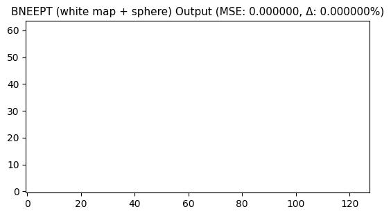    |      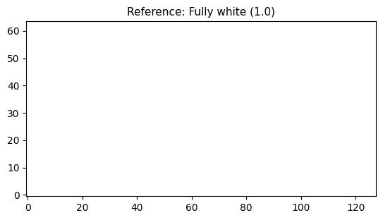     |

#### Debug Output

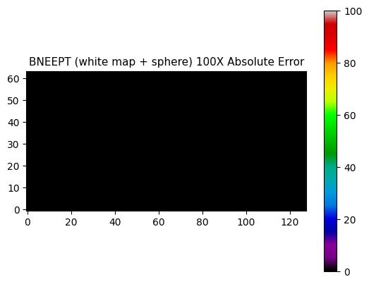

### (4/7) Case BVPT (debug map + sphere + shifted): *\<PASSED\>*

All settings are the same with "BVPT (debug map + sphere)" case, except the sphere and camera are shifted 2000 units in +x. The result should be the same as our environment map depends on view direction only.

Time spent: 54 seconds.

|  Output  |  Reference  |
| :------: | :---------: |
|    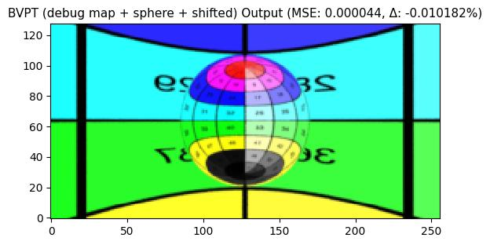    |           |

#### Debug Output

### (5/7) Case BVPT (debug map + sphere): *\<PASSED\>*

Time spent: 42 seconds.

|  Output  |  Reference  |
| :------: | :---------: |
|    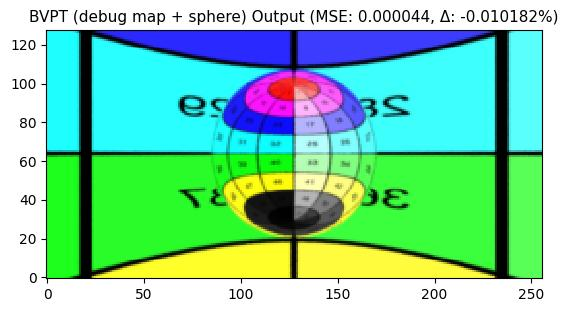    |           |

#### Debug Output

### (6/7) Case BVPT (white map + sphere): *\<PASSED\>*

Effectively a white furnace test.

Time spent: 5 seconds.

|  Output  |  Reference  |
| :------: | :---------: |
|    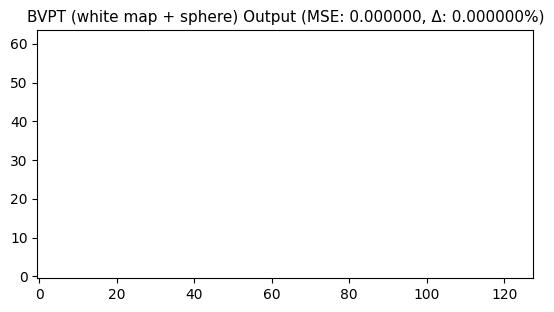    |           |

#### Debug Output

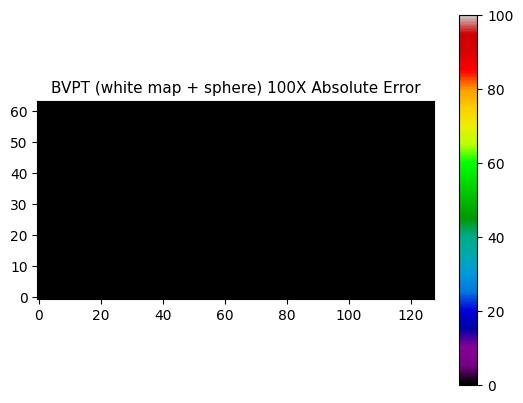

### (7/7) Case PPPM (white map + plane): *\<PASSED\>*

Effectively a white furnace test. The receiver is placed fairly close to the plane, looking at the horizon (forms grazing angles). The environment sphere is also shifted and rotated, which should not affect the result.

Time spent: 34 seconds.

|  Output  |  Reference  |
| :------: | :---------: |
|    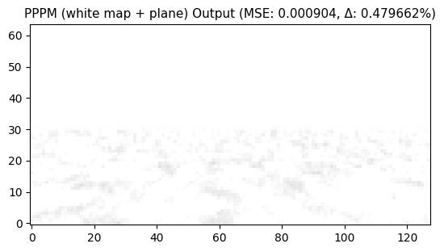    |           |

#### Debug Output

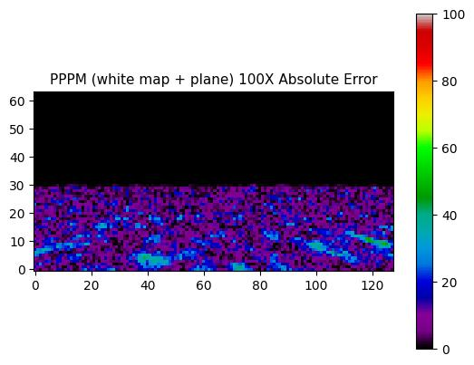

## Test Fullscreen Unit Radiance

These scenes are all arranged in a way that they should render as a frame filled with
white of unit magnitude (1, 1, 1). All output images should appear white, and all images showing
error should be completely black (or any other color representing 0, depending on the color map).

Contains 3 test case(s) (BNEEPT, BVPT, SPPM).

### (1/3) Case BNEEPT: *\<PASSED\>*

Time spent: 4 seconds.

|  Output  |  Reference  |
| :------: | :---------: |
|    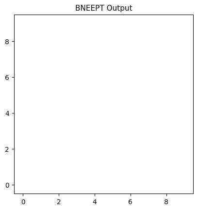    |      (no reference image)     |

#### Debug Output

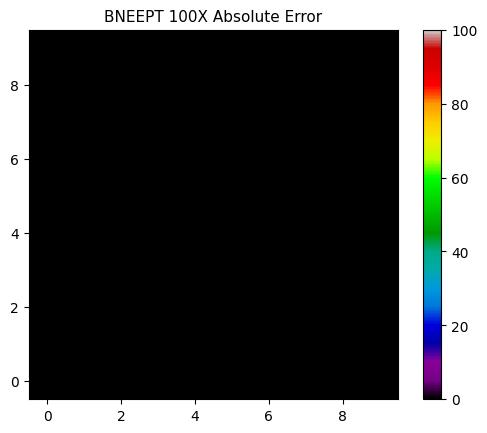

### (2/3) Case BVPT: *\<PASSED\>*

Time spent: 6 seconds.

|  Output  |  Reference  |
| :------: | :---------: |
|    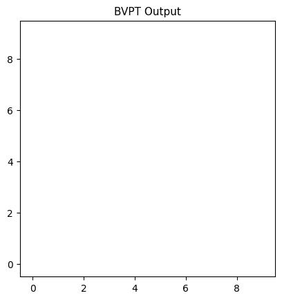    |      (no reference image)     |

#### Debug Output

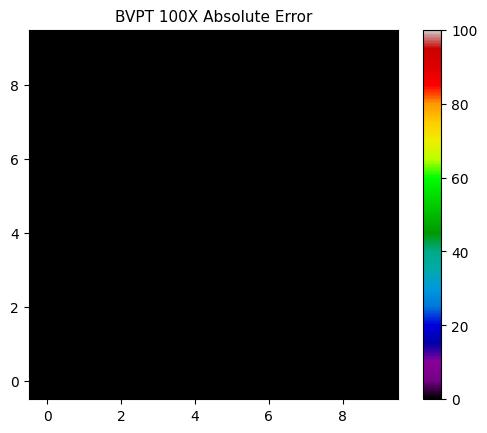

### (3/3) Case SPPM: *\<PASSED\>*

Time spent: 5 seconds.

|  Output  |  Reference  |
| :------: | :---------: |
|        |      (no reference image)     |

#### Debug Output

## Test Glossy Plane

A glossy plane is being illuminated by an average size area light. This scene is modeled and exported
from Blender. Expected to see glossy appearance clearly.

Contains 2 test case(s) (BNEEPT, BVPT).

### (1/2) Case BNEEPT: *\<PASSED\>*

Time spent: 62 seconds.

|  Output  |  Reference  |
| :------: | :---------: |
|        |      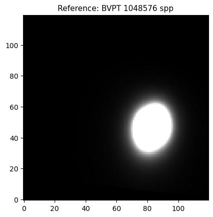     |

#### Debug Output

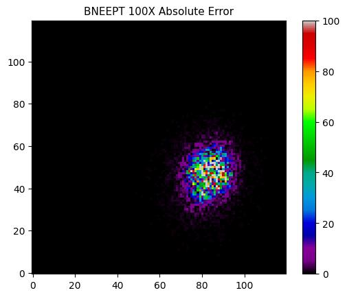

### (2/2) Case BVPT: *\<PASSED\>*

Time spent: 61 seconds.

|  Output  |  Reference  |
| :------: | :---------: |
|    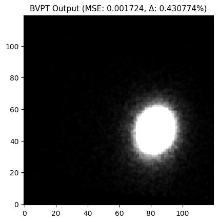    |           |

#### Debug Output

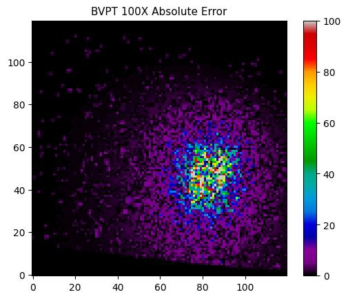

## Test Gray Furnace Box

The classical white furnace test, with medium gray background to better judge energy loss/gain. There is
an object placed in the middle. If there is no energy loss in the target model, then the output image
should be 0.5 for all pixels.

Contains 7 test case(s) (BNEEPT Diffuse Sphere, BNEEPT Diffuse Sphere (Small Box), BNEEPT Glass Cube, BNEEPT Glass Sphere, BVPT Diffuse Sphere, PPPM Glass Cube, SPPM Diffuse Sphere).

### (1/7) Case BNEEPT Diffuse Sphere: *\<PASSED\>*

Time spent: 68 seconds.

|  Output  |  Reference  |
| :------: | :---------: |
|        |      (no reference image)     |

#### Debug Output

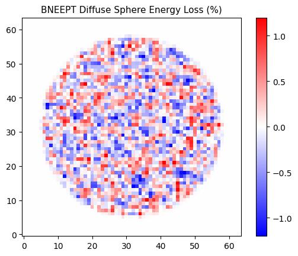

Debug message: mean diff = -0.00000754, max pixel = 0.50798923, min pixel = 0.49290168

### (2/7) Case BNEEPT Diffuse Sphere (Small Box): *\<PASSED\>*

All settings are the same with "BNEEPT Diffuse Sphere" case, except the furnace is a smaller box (2000 -> 40, 50X reduction).

Time spent: 54 seconds.

|  Output  |  Reference  |
| :------: | :---------: |
|    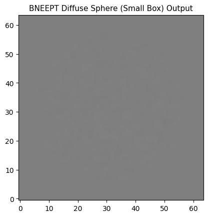    |      (no reference image)     |

#### Debug Output

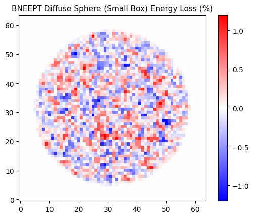

Debug message: mean diff = 0.00002865, max pixel = 0.50627112, min pixel = 0.49308020

### (3/7) Case BNEEPT Glass Cube: *\<PASSED\>*

Time spent: 65 seconds.

|  Output  |  Reference  |
| :------: | :---------: |
|    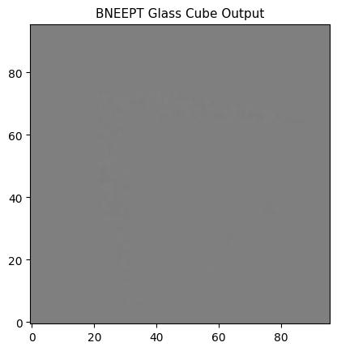    |      (no reference image)     |

#### Debug Output

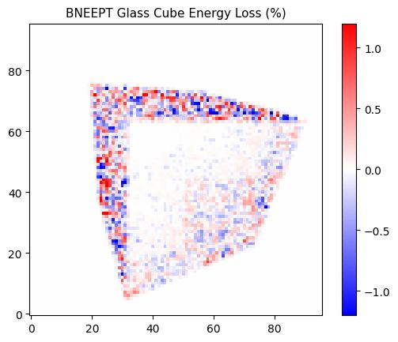

Debug message: mean diff = 0.00000740, max pixel = 0.50937456, min pixel = 0.49018809

### (4/7) Case BNEEPT Glass Sphere: *\<PASSED\>*

Time spent: 17 seconds.

|  Output  |  Reference  |
| :------: | :---------: |
|    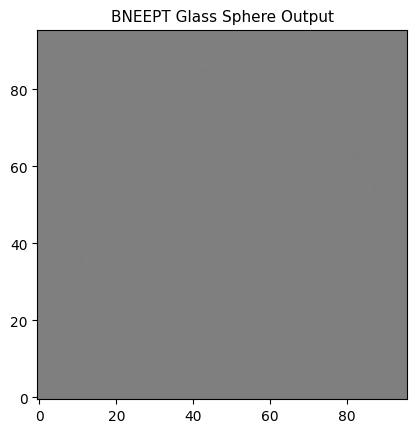    |      (no reference image)     |

#### Debug Output

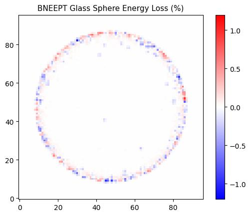

Debug message: mean diff = 0.00000082, max pixel = 0.50475943, min pixel = 0.49418458

### (5/7) Case BVPT Diffuse Sphere: *\<PASSED\>*

Time spent: 23 seconds.

|  Output  |  Reference  |
| :------: | :---------: |
|    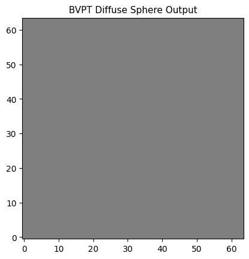    |      (no reference image)     |

#### Debug Output

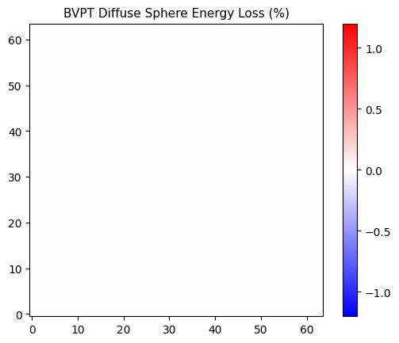

Debug message: mean diff = 0.00000000, max pixel = 0.50000000, min pixel = 0.50000000

### (6/7) Case PPPM Glass Cube: *\<PASSED\>*

Time spent: 49 seconds.

|  Output  |  Reference  |
| :------: | :---------: |
|    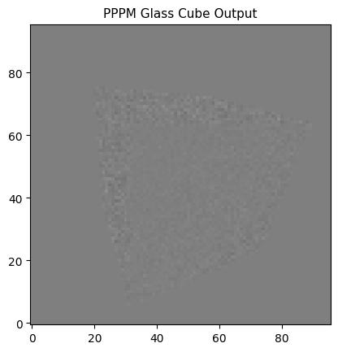    |      (no reference image)     |

#### Debug Output

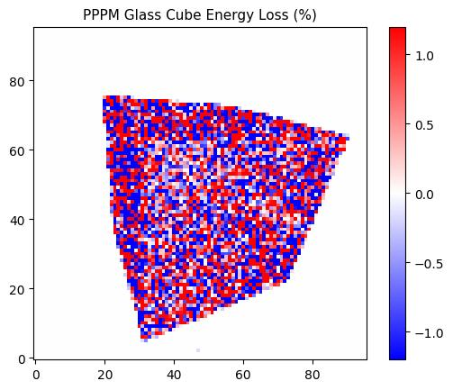

Debug message: mean diff = -0.00000571, max pixel = 0.55768663, min pixel = 0.44436574

### (7/7) Case SPPM Diffuse Sphere: *\<PASSED\>*

Time spent: 198 seconds.

|  Output  |  Reference  |
| :------: | :---------: |
|    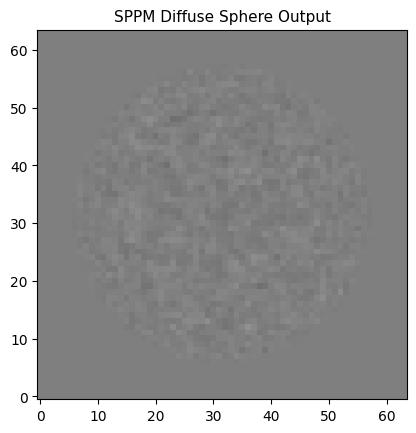    |      (no reference image)     |

#### Debug Output

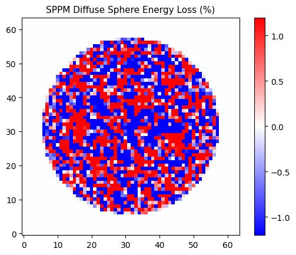

Debug message: mean diff = -0.00008418, max pixel = 0.56600988, min pixel = 0.43596676

## Test Lerped Lambertian Diffuse

A sphere with lerped Lambertian diffuse of different factors, comparing against a non-lerped (albedo = 
100%) reference. The ground is non-lerped diffusive (albedo = 50%).

Contains 5 test case(s) (BNEEPT (factor = 0 percent), BNEEPT (factor = 50 percent), BVPT (factor = 0 percent), BVPT (factor = 50 percent), BVPT (factor = 80 percent)).

### (1/5) Case BNEEPT (factor = 0 percent): *\<PASSED\>*

This is a corner case where the lerping factor is 0 (0 * material_0 + 1 * material_0).

Time spent: 148 seconds.

|  Output  |  Reference  |
| :------: | :---------: |
|        |      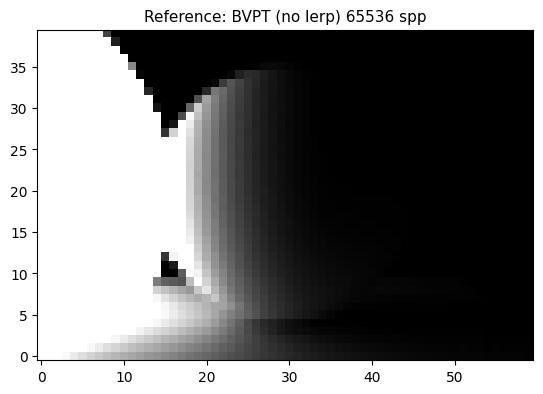     |

#### Debug Output

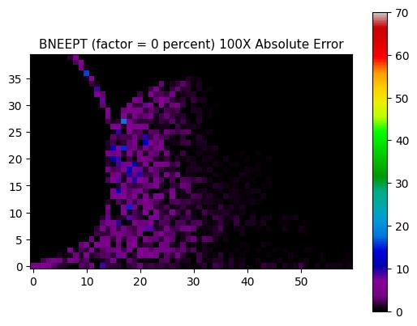

### (2/5) Case BNEEPT (factor = 50 percent): *\<PASSED\>*

Time spent: 187 seconds.

|  Output  |  Reference  |
| :------: | :---------: |
|        |           |

#### Debug Output

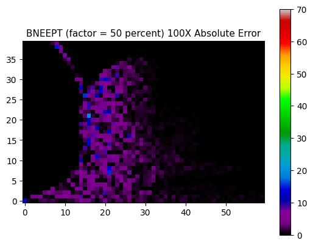

### (3/5) Case BVPT (factor = 0 percent): *\<PASSED\>*

This is a corner case where the lerping factor is 0 (0 * material_0 + 1 * material_0).

Time spent: 120 seconds.

|  Output  |  Reference  |
| :------: | :---------: |
|    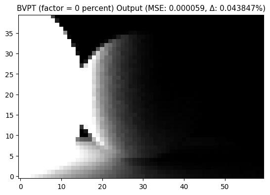    |           |

#### Debug Output

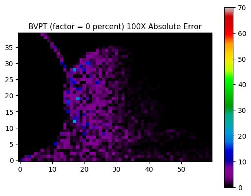

### (4/5) Case BVPT (factor = 50 percent): *\<PASSED\>*

Time spent: 136 seconds.

|  Output  |  Reference  |
| :------: | :---------: |
|    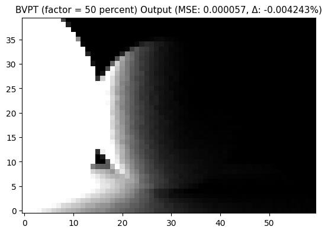    |           |

#### Debug Output

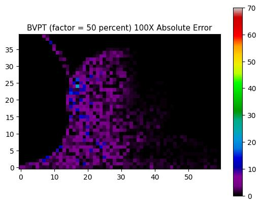

### (5/5) Case BVPT (factor = 80 percent): *\<PASSED\>*

Time spent: 136 seconds.

|  Output  |  Reference  |
| :------: | :---------: |
|        |           |

#### Debug Output

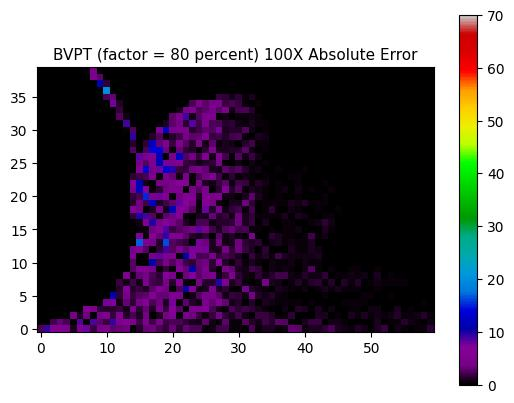

## Test Single Ply Mesh

A single .ply mesh is placed between a large area light and diffusive ground. The mesh itself is diffusive.

Contains 8 test case(s) (Quad (BNEEPT), Quad (BNEEPT, ASCII), Quad (BVPT), Quad (BVPT, ASCII), Quad (SPPM), Suzanne (BNEEPT), Suzanne (BVPT), Suzanne (SPPM)).

### (1/8) Case Quad (BNEEPT): *\<PASSED\>*

Time spent: 23 seconds.

|  Output  |  Reference  |
| :------: | :---------: |
|    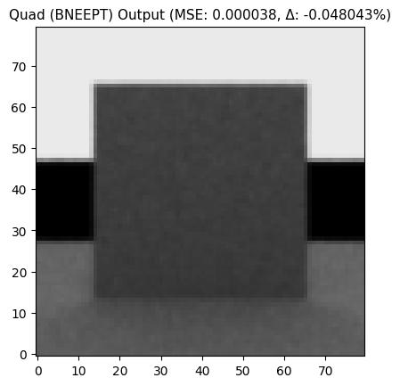    |      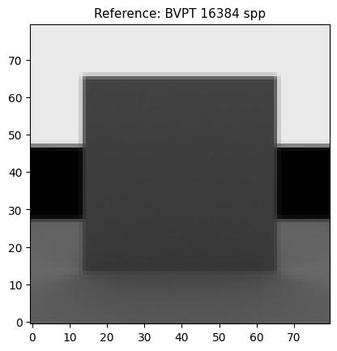     |

#### Debug Output

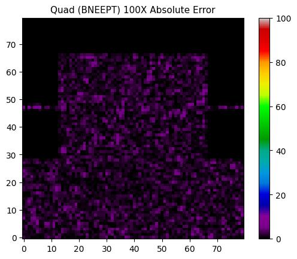

### (2/8) Case Quad (BNEEPT, ASCII): *\<PASSED\>*

Time spent: 18 seconds.

|  Output  |  Reference  |
| :------: | :---------: |
|    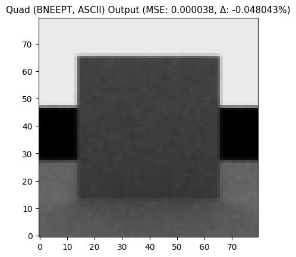    |           |

#### Debug Output

### (3/8) Case Quad (BVPT): *\<PASSED\>*

Time spent: 12 seconds.

|  Output  |  Reference  |
| :------: | :---------: |
|    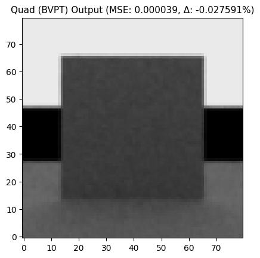    |           |

#### Debug Output

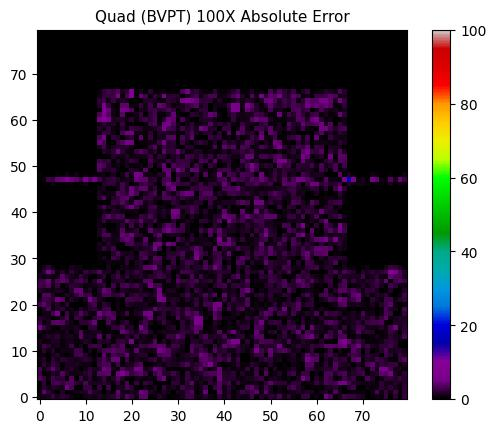

### (4/8) Case Quad (BVPT, ASCII): *\<PASSED\>*

Time spent: 7 seconds.

|  Output  |  Reference  |
| :------: | :---------: |
|    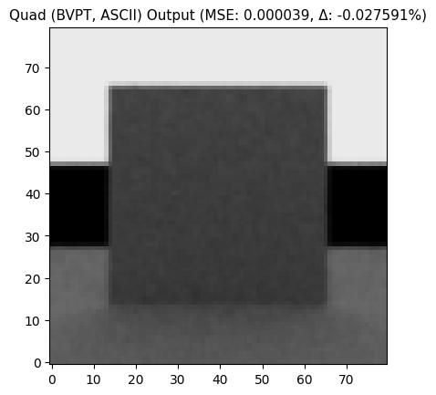    |           |

#### Debug Output

### (5/8) Case Quad (SPPM): *\<PASSED\>*

Time spent: 213 seconds.

|  Output  |  Reference  |
| :------: | :---------: |
|        |           |

#### Debug Output

### (6/8) Case Suzanne (BNEEPT): *\<PASSED\>*

Time spent: 33 seconds.

|  Output  |  Reference  |
| :------: | :---------: |
|        |           |

#### Debug Output

### (7/8) Case Suzanne (BVPT): *\<PASSED\>*

Time spent: 13 seconds.

|  Output  |  Reference  |
| :------: | :---------: |
|        |           |

#### Debug Output

### (8/8) Case Suzanne (SPPM): *\<PASSED\>*

Time spent: 126 seconds.

|  Output  |  Reference  |
| :------: | :---------: |
|        |           |

#### Debug Output

## Test Threading Cornell Box With Gold Sphere

This test is for testing threaded rendering on a simple scene.

Contains 7 test case(s) (BNEEPT (1) 1T, BNEEPT (2) 2T, BNEEPT (3) 5T, BNEEPT (4) 8T, BNEEPT (5) 17T, BNEEPT (6) 64T, BNEEPT (7) 100T).

### (1/7) Case BNEEPT (1) 1T: *\<PASSED\>*

Time spent: 265 seconds.

|  Output  |  Reference  |
| :------: | :---------: |
|        |           |

#### Debug Output

### (2/7) Case BNEEPT (2) 2T: *\<PASSED\>*

Time spent: 269 seconds.

|  Output  |  Reference  |
| :------: | :---------: |
|        |           |

#### Debug Output

### (3/7) Case BNEEPT (3) 5T: *\<PASSED\>*

Time spent: 55 seconds.

|  Output  |  Reference  |
| :------: | :---------: |
|        |           |

#### Debug Output

### (4/7) Case BNEEPT (4) 8T: *\<PASSED\>*

Time spent: 49 seconds.

|  Output  |  Reference  |
| :------: | :---------: |
|        |           |

#### Debug Output

### (5/7) Case BNEEPT (5) 17T: *\<PASSED\>*

Time spent: 29 seconds.

|  Output  |  Reference  |
| :------: | :---------: |
|        |           |

#### Debug Output

### (6/7) Case BNEEPT (6) 64T: *\<PASSED\>*

Time spent: 30 seconds.

|  Output  |  Reference  |
| :------: | :---------: |
|        |           |

#### Debug Output

### (7/7) Case BNEEPT (7) 100T: *\<PASSED\>*

Time spent: 25 seconds.

|  Output  |  Reference  |
| :------: | :---------: |
|        |           |

#### Debug Output

## Test White 100W Point Light

This test is similar to the "white_100W_small_rect_area_light" test, except that we are using a
point light here. In Photon, we do not have true point light, they are just tiny spherical light.
This test is not suitable to run using BVPT, as it may require way more than 10M samples to have
proper convergence.

Contains 2 test case(s) (BNEEPT, SPPM).

### (1/2) Case BNEEPT: *\<PASSED\>*

Time spent: 135 seconds.

|  Output  |  Reference  |
| :------: | :---------: |
|        |           |

#### Debug Output

### (2/2) Case SPPM: *\<PASSED\>*

Time spent: 6 seconds.

|  Output  |  Reference  |
| :------: | :---------: |
|        |           |

#### Debug Output

## Test White 100W Rect Area Light

A rectangular area light is shining the ground below it. The ground is diffusive (albedo = 50%).

Contains 3 test case(s) (BNEEPT, BVPT, SPPM).

### (1/3) Case BNEEPT: *\<PASSED\>*

Time spent: 87 seconds.

|  Output  |  Reference  |
| :------: | :---------: |
|        |           |

#### Debug Output

### (2/3) Case BVPT: *\<PASSED\>*

Time spent: 70 seconds.

|  Output  |  Reference  |
| :------: | :---------: |
|        |           |

#### Debug Output

### (3/3) Case SPPM: *\<PASSED\>*

Time spent: 9 seconds.

|  Output  |  Reference  |
| :------: | :---------: |
|        |           |

#### Debug Output

## Test White 100W Small Rect Area Light

This test is similar to the "white_100W_rect_area_light" test, except that the rectangular
area light is much smaller (0.005 x 0.005 unit^2), and the light source is placed higher above the
ground so it cannot induce too much variance (it is a strong radiance source). This test is not
suitable to run using  BVPT, as it may require way more than 10M samples to have proper convergence.

Contains 2 test case(s) (BNEEPT, SPPM).

### (1/2) Case BNEEPT: *\<PASSED\>*

Time spent: 12 seconds.

|  Output  |  Reference  |
| :------: | :---------: |
|        |           |

#### Debug Output

### (2/2) Case SPPM: *\<PASSED\>*

Time spent: 11 seconds.

|  Output  |  Reference  |
| :------: | :---------: |
|        |           |

#### Debug Output

## Test White 500W Rect Area Light Side

This test places a bigger rectangular area light on the left, and objects of different materials are being
illuminated. Since the light is quite large, all rendering methods should be able to perform this test.

Contains 4 test case(s) (BNEEPT Diffuse Sphere, BNEEPT Glass Sphere, BVPT Diffuse Sphere, BVPT Glass Sphere).

### (1/4) Case BNEEPT Diffuse Sphere: *\<PASSED\>*

Time spent: 29 seconds.

|  Output  |  Reference  |
| :------: | :---------: |
|        |           |

#### Debug Output

### (2/4) Case BNEEPT Glass Sphere: *\<PASSED\>*

Time spent: 49 seconds.

|  Output  |  Reference  |
| :------: | :---------: |
|        |           |

#### Debug Output

### (3/4) Case BVPT Diffuse Sphere: *\<PASSED\>*

Time spent: 28 seconds.

|  Output  |  Reference  |
| :------: | :---------: |
|        |           |

#### Debug Output

### (4/4) Case BVPT Glass Sphere: *\<PASSED\>*

Time spent: 49 seconds.

|  Output  |  Reference  |
| :------: | :---------: |
|        |           |

#### Debug Output

